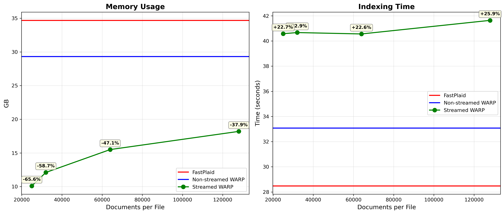

<div align="center">
  <h1>Warp</h1>
  <p align="center">
    
  </p>
</div>
<p align="center">
  
  
  
  
  <a href="https://github.com/rust-lang/rust"></a>
  <a href="https://github.com/pyo3"></a>
  <a href="https://github.com/LaurentMazare/tch-rs"></a>
</p>
<div align="center">
    The Multi-Vector Search Engine To Rule Them All
</div>

&nbsp;

## ⭐️ Overview

xtr-warp-rs is a high-performance implementation of the **WARP** engine for multi-vector retrieval, as described in the [WARP paper (SIGIR 2025)](https://arxiv.org/abs/2501.17788). Originally built with [XTR models (NeurIPS 2023)](https://arxiv.org/abs/2304.01982) in mind, as it turns out, it significantly outperforms all other multi-vector search engines while keeping retrieval metrics competitive.

Compared to the current SOTA (FastPlaid), xtr-warp-rs focuses on doing less work per query while staying close in quality: it prunes the centroid/posting-list space per token, uses an error-aware merge that keeps ranking stable with fewer examined candidates, and keeps the hot path (selection → decompression → merge) highly optimized and parallel friendly.

**Speed**: Achieves **3-10x** speedup on CUDA and **8-180x** on CPU (depending on dataset and thread count) vs FastPlaid.

**Memory**: During search WARP reduces memory footprint by **58%** on average vs FastPlaid, reaching **76%** on the larger indices. During index creation the VRAM usage is around **10%** less, with an optional streaming mode that reduces it further by **66%** at a **20-25%** speed cost.

Check the [benchmark section](#benchmarks) for detailed comparisons.

> [!NOTE]
> The memory benchmarks were done in CPU for search and in GPU for index creation

&nbsp;

## Installation

```bash
uv pip install xtr-warp-rs
```

## PyTorch Compatibility

xtr-warp-rs supports three torch versions:

| xtr-warp-rs Version | PyTorch Version | Installation Command                |
| ------------------- | --------------- | ----------------------------------- |
| 1.0.290         | 2.9.0           | `uv pip install xtr-warp-rs==1.0.290` |
| 1.0.280         | 2.8.0           | `uv pip install xtr-warp-rs==1.0.280` |
| 1.0.270         | 2.7.0           | `uv pip install xtr-warp-rs==1.0.270` |

### Build from Source

**Install Rust:**

```bash
curl --proto '=https' --tlsv1.2 -sSf https://sh.rustup.rs | sh
```

**Install `uv`:**

```bash
curl -LsSf https://astral.sh/uv/install.sh | sh
# or
pip install uv
```

**Clone and build the repo:**

```bash
git clone git@github.com:pau-mensa/xtr-warp-rs.git
cd xtr-warp-rs
make install # or make install-gpu if you have a GPU available
make build
```

## ⚡️ Quick Start

Get started with creating an index and performing a search in just a few lines of Python.

### In-Memory Embeddings

```python
import torch

from xtr_warp import XTRWarp

xtr_warp = XTRWarp(index="index")

embedding_dim = 128

# Index 100 documents, each with 300 tokens, each token is a 128-dim vector.
xtr_warp.create(
    embeddings_source=[torch.randn(300, embedding_dim) for _ in range(100)],
    device="cpu",
)

# Load the index
xtr_warp.load(device="cpu", dtype=torch.float32)

# Search for 2 queries, each with 50 tokens, each token is a 128-dim vector
scores = xtr_warp.search(
    queries_embeddings=torch.randn(2, 50, embedding_dim),
    top_k=10,
)

print(scores)
```

The output will be a list of lists, where each inner list contains tuples of (document_index, similarity_score) for the top_k results for each query.

### Streaming from Disk (Path-Based)

For large datasets, you can stream embeddings directly from disk instead of loading everything into memory when creating the index. The memory savings can be controlled by the number of documents per file, with the max possible saving being 25k documents, because that's the chunk size used during index creation. What this effectively means is that splitting files by less than 25k documents will **not** result in more memory savings.

```python
from xtr_warp import XTRWarp

xtr_warp = XTRWarp(index="index")

# Stream embeddings from a directory containing .npy files
xtr_warp.create(
    embeddings_source="/path/to/embeddings",
    device="cuda",
)

# Load the index
xtr_warp.load(device="cpu", dtype=torch.float32)

# Search for 2 queries, each with 50 tokens, each token is a 128-dim vector
scores = xtr_warp.search(
    queries_embeddings=torch.randn(2, 50, embedding_dim),
    top_k=10,
)

print(scores)
```

**Required format for path-based inputs:**
- Embeddings must be stored as `.npy` files (2D tensors with shape `[total_tokens, embedding_dim]`)
- Each embeddings file must have a corresponding `.doclens.npy` sidecar file containing a 1D array of document lengths. This pattern is adopted to avoid forcing the padding of documents
- The order of the streaming is controlled by the filenames, it is recommended that they end in `..._idx.npy` or `..._idx.doclens.npy`

Example structure:
```
/path/to/embeddings/
├── embeddings_0.npy          # Shape: [total_tokens, 128]
├── embeddings_0.doclens.npy  # Shape: [num_docs], sum(doclens) = total_tokens
├── embeddings_1.npy
├── embeddings_1.doclens.npy
...
```

&nbsp;

## Benchmarks

- `qps` stands for **Queries Per Second** (higher is better)
- `indexing` stands for the time it took the engine to build the index (lower is better)

### CUDA Performance

| Dataset (Size) | Metric | fast-plaid | xtr-warp-rs |
|----------------|--------|------------|-------------|
| arguana (8,674) | qps | 110.26 | 1008.69 (+814.8%) |
|  | indexing | 1.67s | 1.595s |
|  | ndcg@10 | 0.47 | 0.49 |
|  | recall@10 | 0.73 | 0.75 |
| fiqa (57,638) | qps | 87.16 | 943.08 (+982.0%) |
|  | indexing | 4.90s | 5.51s |
|  | ndcg@10 | 0.41 | 0.37 |
|  | recall@10 | 0.48 | 0.42 |
| nfcorpus (3,633) | qps | 123.87 | 1155.00 (+832.4%) |
|  | indexing | 0.90s | 0.965s |
|  | ndcg@10 | 0.37 | 0.36 |
|  | recall@10 | 0.18 | 0.17 |
| quora (522,931) | qps | 217.47 | 927.92 (+326.7%) |
|  | indexing | 10.51s | 11.44s |
|  | ndcg@10 | 0.88 | 0.86 |
|  | recall@10 | 0.95 | 0.94 |
| scidocs (25,657) | qps | 97.49 | 861.50 (+783.7%) |
|  | indexing | 3.93s | 4.17s |
|  | ndcg@10 | 0.19 | 0.18 |
|  | recall@10 | 0.19 | 0.19 |
| scifact (5,183) | qps | 112.30 | 1133.98 (+909.8%) |
|  | indexing | 1.42s | 1.47s |
|  | ndcg@10 | 0.74 | 0.73 |
|  | recall@10 | 0.86 | 0.85 |
| trec-covid (171,332) | qps | 43.16 | 282.75 (+555.1%) |
|  | indexing | 17.44s | 19.47s |
|  | ndcg@10 | 0.84 | 0.80 |
|  | recall@10 | 0.02 | 0.02 |
| webis-touche2020 (382,545) | qps | 55.37 | 578.41 (+944.6%) |
|  | indexing | 28.48s | 33.08s |
|  | ndcg@10 | 0.25 | 0.24 |
|  | recall@10 | 0.16 | 0.16 |

### CPU Performance

#### Search Speed comparison

| Dataset (Size) | QPS fast-plaid | QPS xtr-warp (Single) | QPS xtr-warp-rs (Multi) |
|----------------|----------------|-----------------------|-------------------------|
| arguana (8,674) | 4.79 | 170.64 (+3462.4%) | 397.89 (+8206.6%) |
| fiqa (57,638) | 4.78 | 129.65 (+2162.3%) | 299.97 (+6175.5%) |
| nfcorpus (3,633) | 6.69 | 189.9 (+2738.5%) | 1252.7 (+18624.9%) |
| quora (522,931) | 8.60 | 100.0 (+1062.7%) | 296.18 (+3343.9%) |
| scidocs (25,657) | 4.52 | 102.78 (+2173.9%) | 260.53 (+5663.9%) |
| scifact (5,183) | 6.14 | 229.48 (+3637.4%) | 514.5 (+8279.4%) |
| trec-covid (171,332) | 1.82 | 17.33 (+852.1%) | 94.0 (+5064.8%) |
| webis-touche2020 (382,545) | 3.14 | 41.63 (+1225.8%) | 145.68 (+4539.4%) |

#### Search Memory comparison

| Dataset (Size) | Peak fast-plaid (GB) | Peak xtr-warp (GB) |
|----------------|----------------|-----------------------|
| arguana (8,674) | 2.21 | 1.19 (-46.15%) |
| fiqa (57,638) | 4.79 | 1.55 (-67.64%) |
| nfcorpus (3,633) | 1.35 | 1.055 (-21.85%) |
| quora (522,931) | 9.11 | 2.02 (-77.82%) |
| scidocs (25,657) | 3.28 | 1.45 (-55.79%) |
| scifact (5,183) | 1.92 | 1.05 (-45.31%) |
| trec-covid (171,332) | 10.8 | 2.45 (-77.31%) |
| webis-touche2020 (382,545) | 12.7 | 3.22 (-74.64%) |

#### Streamed creation

To showcase the benefits and tradeoffs of the stream mode during index creation I ran a benchmark using the `webis-touche2020` dataset (~380K documents). The objective was to split the dataset embeddings into multiple files, achieving a fixed number of documents per file, with a hard cap on 25k documents per file:
- 128k documents per file, 2 splits
- 64k documents per file, 4 splits
- 32k documents per file, 8 splits
- 25k documents per file, 16 splits

<p align="center">
  
</p>

The experiment results demonstrate a **20-25%** speed decrease that stays constant across all split sizes, but a memory usage that decreases the more splits we have, ranging from **38%** savings on the least aggresive split (only 2) to **66%** on the most aggressive one (16 splits).

&nbsp;

> [!NOTE]  
> These benchmarks were run on an NVIDIA 5090 with an AMD Ryzen 9950 CPU and using `float32` memory mapped tensors

### Reproducibility

Check the [docs](benchmark/README.md) on how to run the benchmark scripts in order to reproduce the results.

## Usage

### Automatic Hyperparameter Optimization

When search parameters are set to `None`, xtr-warp-rs automatically optimizes them based on index metadata and query characteristics. The optimization considers:

- **Index density** (`num_embeddings / num_partitions`): Determines how many embeddings are distributed across clusters
- **Corpus statistics**: Including total embeddings, number of partitions, and average document length
- **Query characteristics**: Number of tokens and desired `top_k` results
- **Dataset properties**: Dense vs sparse distributions, long vs short queries

The optimizer balances recall/accuracy against latency by adjusting parameters like `nprobe` (more probes for dense corpora or long queries), `bound` (larger for high partition counts), `t_prime` (adaptive based on corpus density and query length), and `max_candidates` (scaled with expected candidates).

### Search

```python
Parameter                   Default     Description
nprobe                      None        Number of centroids probed per query token (e.g 8)
bound                       None        Centroids considered before selecting top nprobe (e.g 128)
t_prime                     None        Missing-token penalty (larger = harsher, smaller = more forgiving) (e.g 5000)
centroid_score_threshold    None        Per-token filter to skip weak tokens, from 0 to 1 (e.g 0.5)
max_candidates              None        Cap on document candidates before final selection (e.g 64000)
batch_size                  8192        Batch size for centroid scoring (watch out for VRAM spike in large indices)
num_threads                 1           Upper bound for CPU parallelism during search (not used on CUDA)
```

### Indexing

The `create()` method accepts embeddings from multiple sources:

- **In-memory**: `list[torch.Tensor]` or `torch.Tensor` - embeddings already loaded in memory
- **Path-based**: `str` or `Path` - path to a directory or file containing `.npy` embeddings (enables streaming)

```python
Parameter                  Default     Description
embeddings_source          required    Source of document embeddings (see above)
device                     required    Device to use for index creation (e.g., "cpu", "cuda", "mps")
kmeans_niters              4           K-means iterations for clustering
max_points_per_centroid    256         Maximum points per centroid during K-means
nbits                      4           Product quantization bits for compression
n_samples_kmeans           None        Samples for K-means clustering
seed                       42          Random seed for reproducibility
use_triton_kmeans          None        Whether to use Triton-based K-means
```

> [!IMPORTANT]
> Highly recommended to build the index using `cuda` devices. For a large corpus using `cpu` or even `mps` can take forever.

> [!NOTE]
> When using path-based inputs, embeddings files must be 2D tensors (not 3D padded tensors) with accompanying `.doclens.npy` sidecars. See [Quick Start](#%EF%B8%8F-quick-start) for format details.

### Loading

To help with memory management the API also exposes the `load` and `free` methods, which, as the name implies, load and free the index from memory respectively.

```python
Parameter                 Default        Description
device                    required       Device where to load the index (e.g., "cpu", "cuda", "mps")
dtype                     torch.float32  Dtype to use for the centroids and bucket weights. Lowers the memory footprint but can cause alterations in retrieval metrics
mmap                      True           Whether or not to load the large tensors ("codes" and "residuals") using memory mapping. Only available in "cpu"
```

> [!WARNING]
> The operator `aten::unique_dim` is not implemented in torch for the `mps` device, so if you want to use it you will need to set up the env var `PYTORCH_ENABLE_MPS_FALLBACK=1`, which fallbacks to the CPU

### Index Mutability

WARP supports incremental index mutations without requiring a full rebuild. Documents can be added, updated, or deleted after the initial `create()` call, and all changes are immediately reflected in search results.

#### How it works

- **Deletions** are O(1) tombstone operations: passage IDs are written to a `deleted_pids.npy` file and filtered out at search time. No data is physically removed until compaction runs.
- **Additions** encode new embeddings into chunks and incrementally merge them into the existing compacted structures. Only the new chunks are processed — old data is left untouched. Small additions (< 2,000 documents) are coalesced into the last chunk to avoid file fragmentation.
- **Updates** combine both: the old passage IDs are tombstoned and the replacement embeddings are encoded with the same IDs, so the document identity is preserved.
- **Compaction** physically removes tombstoned data by rewriting chunks, pruning empty centroids, rebuilding the compacted layout, and recalibrating internal thresholds.

After each `add()`, the engine also checks for *outlier* embeddings (those far from any existing centroid). If enough outliers are found, it runs K-means on them and expands the centroid codebook, keeping cluster quality stable as the distribution shifts. The outlier detection threshold is recalibrated via a weighted average so it adapts to the evolving data.

#### Delete

```python
xtr_warp.delete(passage_ids=[0, 3, 7])
```

```python
Parameter                   Default     Description
passage_ids                 required    List of passage IDs to mark as deleted
compact_threshold           0.2         Fraction of deleted passages that triggers auto-compaction. Set to None to disable
```

When the ratio of tombstoned passages exceeds `compact_threshold`, compaction runs automatically.

#### Add

```python
new_ids = xtr_warp.add(
    embeddings_source=[torch.randn(200, 128) for _ in range(10)],
)
```

```python
Parameter                   Default     Description
embeddings_source           required    New document embeddings (same formats as create)
reload                      True        Auto-reload index after mutation so searches reflect the new data
min_outliers                50          Minimum outlier count to trigger centroid expansion
max_growth_rate             0.1         Maximum ratio of new centroids relative to current codebook size
max_points_per_centroid     256         Points per centroid for expansion K-means
```

Returns the list of newly assigned passage IDs.

#### Update

```python
xtr_warp.update(
    passage_ids=[0, 1],
    embeddings_source=[torch.randn(200, 128), torch.randn(150, 128)],
)
```

```python
Parameter                   Default     Description
passage_ids                 required    IDs of passages to replace
embeddings_source           required    Replacement embeddings (one per passage ID)
reload                      True        Auto-reload index after mutation
```

#### Compact

```python
xtr_warp.compact()
```

```python
Parameter                   Default     Description
reload                      True        Auto-reload index after compaction
```

Compaction rewrites all chunks to exclude deleted passages, prunes centroids that no longer have any assigned embeddings, rebuilds the centroid-sorted layout, and recalibrates the cluster threshold and average residual. Use it after a batch of deletions or updates to reclaim disk space and keep the index tight.

#### Typical lifecycle

```python
idx = XTRWarp(index="my_index")

# 1. Create the initial index
idx.create(embeddings_source=docs, device="cuda")
idx.load(device="cpu", dtype=torch.float32)

# 2. Search
results = idx.search(queries_embeddings=queries, top_k=10)

# 3. Incremental mutations
new_ids = idx.add(new_docs)                          # new passage IDs assigned
idx.update(passage_ids=[5], embeddings_source=[upd])  # replace doc 5
idx.delete(passage_ids=[2, 8])                        # tombstone docs 2 and 8

# 4. Searches immediately reflect all changes
results = idx.search(queries_embeddings=queries, top_k=10)

# 5. Compact when convenient
idx.compact()
```

&nbsp;

## Citation

You can cite **xtr-warp-rs** in your work as follows:

```bibtex
@software{xtrwarprs,
  author = {Montserrat, Pau},
  title = {WARP: The Multi-Vector Search Engine To Rule Them All},
  year = {2025},
  url = {https://github.com/pau-mensa/xtr-warp-rs}
}
```

And for WARP (arXiv entry):

```bibtex
@misc{warp2025,
  title = {WARP: An Efficient Engine for Multi-Vector Retrieval},
  author = {Scheerer, Jan-Luca and Zaharia, Matei and Potts, Christopher and Alonso, Gustavo and Khattab, Omar},
  year = {2025},
  eprint = {2501.17788},
  archivePrefix = {arXiv},
  primaryClass = {cs.IR},
  url = {https://arxiv.org/abs/2501.17788}
}
```

## Contributing

This is an active in development project. Contributions are welcome, particularly in:
- Metadata filtering
- Adding a reranking step at the end of the search pipeline can stabilize the retrieval metrics, especially for datasets like `fiqa`

## Acknowledgments

I would like to personally acknowledge the creators and maintainers of the [FastPlaid](https://github.com/lightonai/fast-plaid/tree/main) library, from which I took most of the boilerplate code used here.
